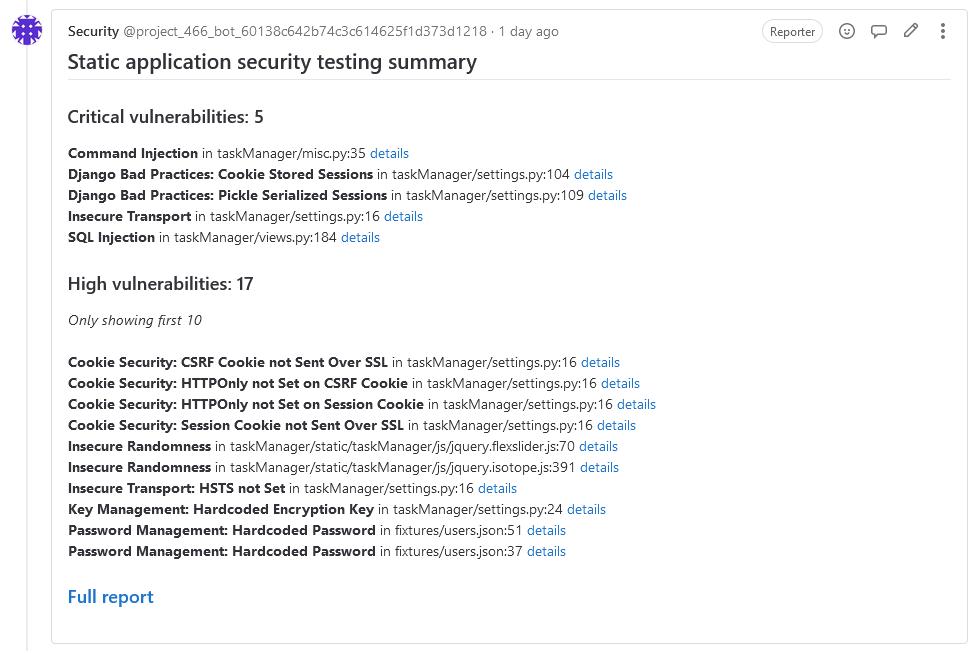
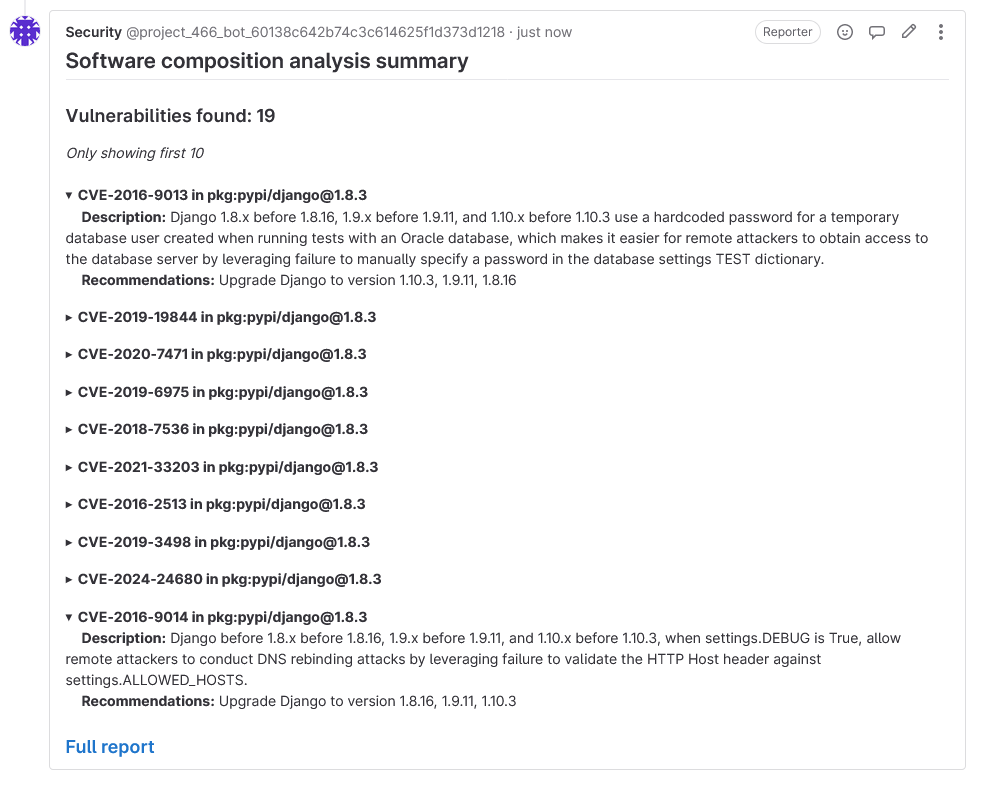

# MR. Decorator
Gitlab merge request decorator.
Currently, it supports the following analysis formats:
* Fortify Static Code Analyzer .fpr artifacts
* CycloneDX json sbom
* Dependency check json report

The core package with is located [here](https://github.com/Tihmmm/mr-decorator-core).

You may also extend the decorator by implementing [core](https://github.com/Tihmmm/mr-decorator-core)'s `Parser` interface and registering your implementation in [registry](https://github.com/Tihmmm/mr-decorator-core/blob/4025c2bc7f6b07df8b0fd2e05f1570c9dff2c63f/parser/parser.go).

### Examples
* Fortify SAST

* Cyclonedx (generated by trivy)

 
